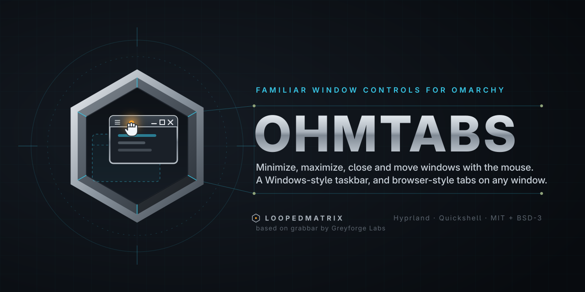

# OhmTabs

<p align="center">
  
</p>

<p align="center">
  <a href="https://github.com/LoopedMatrix/ohmtabs/actions/workflows/test.yml"></a>
  <a href="LICENSE"></a>
  
  
</p>

**OhmTabs** gives ordinary application windows a Windows/macOS-style title strip — window menu, Minimize, Maximize/Restore, Close, drag-to-move — and **adds two things Omarchy doesn't have out of the box**: a **Windows-style taskbar for minimized windows**, and **browser-style tabs**, where dropping one window onto another turns the target into a tab host.

It is a [Quickshell](https://github.com/outfoxxed/quickshell) plugin paired with a native Hyprland plugin that draws the strips and moves the windows.


## Requirements

- [Omarchy](https://github.com/omacom/omarchy) 4 (Arch + Hyprland), Hyprland **0.56.2** — the native half uses the Lua dispatcher API
- Quickshell (shipped with Omarchy), Qt 6, a C++17 compiler and `make` for the native half
- Optional: `bin/ohmtabs` for the CLI, and a symlink into `~/.local/bin` if you want it on `PATH`

## What it is, and where it comes from

OhmTabs is a personal fork of [GreyforgeLabs/omarchy-grabbar](https://github.com/GreyforgeLabs/omarchy-grabbar) (which is itself based on [hyprbars](https://github.com/hyprwm/hyprland-plugins)). It was forked because the version here **deviates substantially from upstream** — the drawer-first minimized-window UX was replaced with a real taskbar, window tabs were added, and the shell-facing surface (IPC, hot-applied settings, recovery tooling) was rebuilt. Upstream's strip backend, recovery journal and test suite are inherited and credited in [License & credits](#license--credits).

| Area | What changed |
| --- | --- |
| **Minimized-window taskbar** | A Windows-style taskbar ([`SidePanel.qml`](SidePanel.qml)) replaces the drawer-first UX: bottom/left/right placement, app icon + title + origin workspace, **Restore all**, optional auto-hide with a 4 px reveal sliver, and *no surface at all* when nothing is minimized (`live = panelEnabled && count > 0`). |
| **Window tabs** | Dropping a window onto another makes the target the **host** and gives its title strip a tab strip (drawn natively), browser-style: smart alt-tab (`ohmtabs alttab`: a group's tabs when the pointer is on its host, the browser's own tab switching in Brave/Chrome, otherwise the normal window cycle), drag a tab out to detach, and a **"close all N window(s)?"** confirmation before a group closes — see [Tab groups](#tab-groups). |
| **Hot-applied settings** | The plugin's settings entry is watched and applied live — changing `panelPosition` or `panelAutoHide` takes effect with **no shell restart**. |
| **Scripting / IPC surface** | A complete command surface plus the `bin/ohmtabs` CLI and a stable token format. |
| **The freeze fix** | Upstream's bar assigns `settings`/`moduleName`/`bar` onto every widget. Those are writable here, fixing a `TypeError: Cannot assign to read-only property "settings"` that wedged the whole shell (commit `0d79811`). See [Troubleshooting](#troubleshooting). |
| **Per-monitor panels** | The taskbar resolves its own screen (`resolveScreen()`), so multi-monitor setups get exactly one panel per monitor instead of N stacked surfaces. |

## Install

Two parts: the **shell plugin** (widget, taskbar, tabs, settings, IPC) and the **native strip backend** (a Hyprland plugin that draws the strips, hosts the tabs and moves minimized windows).

### 1. Shell plugin

```sh
omarchy plugin add https://github.com/LoopedMatrix/ohmtabs.git --enable
```

This installs to `~/.config/omarchy/plugins/tech.loopedmatrix.ohmtabs` and enables it.

### 2. Native strip backend

```sh
cd ~/.config/omarchy/plugins/tech.loopedmatrix.ohmtabs
make -C native/ohmtabs CXX=g++
hyprctl plugin load ./native/ohmtabs/ohmtabs.so
```

> **Without the native part** there are no strips, no tabs, and Minimize stays off; the shell side (bar widget, taskbar, settings, IPC) still mounts.

### 3. Autoload and the CLI (optional)

```sh
cd ~/.config/omarchy/plugins/tech.loopedmatrix.ohmtabs
ln -s "$(pwd)/bin/ohmtabs" ~/.local/bin/ohmtabs   # optional: CLI on PATH
ohmtabs autoload enable                           # survive compositor/shell restarts
```

[`docs/AUTOLOAD.md`](docs/AUTOLOAD.md) explains the autoload hook and its boot guard.

## Everyday use

### The title strip

Every ordinary application window gets a strip above its top edge:

- **Menu** (hamburger) or **right-click the strip** — window menu (Restore, Minimize, Maximize/Restore, Close).
- **Minimize** — moves the window to the minimized workspace and shows it in the taskbar.
- **Maximize/Restore** — the button reflects the current state.
- **Close** — closes the window.
- **Drag the strip** — move the window; dragging a tiled window detaches it to floating at 60 %.
- **Double-click the title** — toggle maximize.
- **Resize** — drag the strip's edge/corners with `general:resize_on_border = true`.

Controls sit on the right by default; `buttonsLeft` moves them to the left. Hide the strip per app with `excludedClasses`.

### Minimizing and the taskbar

Minimizing moves a window to the special workspace `special:ohmtabs-minimized`. The taskbar shows one button per minimized window, with the app's real icon, the title, and the workspace it came from:

- **Left-click** a button → restore to the **current** workspace.
- **Right-click** a button → restore to its **original** workspace.
- **Restore all** (far end) → restore everything.
- Default placement is the bottom; `panelPosition` moves it to `left` or `right`, and `panelAutoHide` parks it off-screen behind a 4 px sliver that expands on hover.
- Empty taskbar → no surface at all (by design).

### Tab groups

Tab grouping is opt-in: set `tabGroups: true` on the plugin's settings entry.

- **Drop a window onto another** — the target becomes the **host**, its title strip gains a tab strip, and the dropped window becomes a tab. Tab titles come from the windows themselves.
- **Click a tab** to switch to it; **drag a tab out** to detach it back into a normal window. A group that drops to one window dissolves.
- **Alt-tab** is one helper with three jobs, in order: a focused/pointed-at tab group cycles its tabs, a focused browser gets its own `Ctrl+PageDown`/`Ctrl+PageUp` (Brave and Chrome switch tabs with no extension), and everything else falls back to the compositor's window cycle — the same `cycle_next` + `bring_to_top` pair Omarchy's stock `ALT + TAB` bindings ran, so nothing is lost. `ohmtabs alttab next|prev` does it and `--decide` prints the decision without acting; the keybind is yours to add (see [Alt-tab](docs/USAGE.md#alt-tab)).
- **Closing a group** with more than one window asks first — *"are you sure you want to close all N windows?"* — listing the tab titles, with **Cancel** and **Close all**. Cancel/Escape dismisses it with no action, and it does not steal focus from the rest of the shell.

### The bar drawer

The bar widget shows a window-stack glyph and a count:

- **Left-click** → open the drawer (newest-first list with Restore / Original workspace / Restore all).
- **Middle-click** → restore all.
- **Right-click** → open settings.

### Keyboard navigation

Hovering or clicking a button gives the panel keyboard focus:

| Key | Action |
| --- | --- |
| `↓` / `→` / `j` | Move selection down |
| `↑` / `←` / `k` | Move selection up |
| `Enter` | Restore selected (to current workspace) |
| `Shift`+`Enter` | Restore selected to its original workspace |
| `Ctrl`+`A` | Restore all |
| `Esc` | Dismiss |

## Screenshots

Screenshots are being re-captured on a current build — this machine's compositor
(Hyprland 0.56) has no `wlr-screencopy`, so `grim` cannot capture here and the
upstream captures that used to sit here were from a different desktop.
## Configuration

Settings live in the plugin's `shell.json` entry — edit them in **Settings** (bar widget → right-click → Settings) or directly in the shell config. All of them hot-apply; no shell restart.

| Key | Type | Default | Effect |
| --- | --- | --- | --- |
| `enabled` | bool | `true` | Master switch for strips + Minimize. Turning it off restores minimized windows first. |
| `buttonsLeft` | bool | `false` | Window controls on the left (`true`) or right (`false`). |
| `showOnHover` | bool | `false` | Draw the strip only while the pointer is near the window's top edge (legacy upstream behaviour). |
| `controlSize` | `"standard"` \| `"large"` | `"standard"` | Strip thickness: 34 px vs 46 px. |
| `excludedClasses` | string[] | `[]` | App classes whose windows get no strip (same as "Hide OhmTabs for this app"). |
| `sidePanel` | bool | `true` | Windows-style taskbar (`true`) vs the in-bar drawer only (`false`). |
| `panelPosition` | `"bottom"` \| `"left"` \| `"right"` | `"bottom"` | Screen edge the taskbar sits on. |
| `panelAutoHide` | bool | `true` | Park the taskbar off the edge until the pointer reaches it. |
| `tabGroups` | bool | `false` | Enable window tabs (host/tab creation, `groupCycle`, close-all confirmation). The tab strip itself is drawn natively on the host's title strip. |

Unknown keys are ignored and invalid values fall back to the default; validation lives in [`OhmTabsModel.js`](OhmTabsModel.js) (`normalizeSettings`).

### Native config fallback

Before the shell connects, the native half reads `plugin:ohmtabs:*` keys set in `hyprland.lua` (the shell's theme/settings override them once connected):

`enabled`, `buttons_left`, `bar_height` (34), `button_size` (32), `padding` (4), `text_size` (11), `text_font` (`"Sans"`), `bar_color`, `inactive_bar_color`, `text_color`, `hover_color`, `close_hover_color`, `shell_grace_ms` (2000). Per-window opt-out with the `ohmtabs:no_bar` window rule.

## Command line & scripting

`bin/ohmtabs` wraps the plugin's IPC:

```
ohmtabs                      open the minimized-windows drawer (Settings when OhmTabs is off)
ohmtabs setup|settings       open Settings (setup includes the setup check)
ohmtabs status [--json]      health, compatibility and owned minimized-window metadata
ohmtabs windows              list windows known to the native backend
ohmtabs restore TOKEN [--original]   restore one minimized window
ohmtabs restore-all          recover every live window owned by OhmTabs
ohmtabs doctor               read-only diagnostic report; never an implicit repair
ohmtabs autoload status|enable|disable|retry
ohmtabs enable|disable       toggle OhmTabs (disable restores windows first)
ohmtabs uninstall            restore windows, turn OhmTabs off, remove autoload hook + plugin
```

Exit codes: `0` ok · `2` usage · `3` backend unavailable · `4` stale target · `5` restore UI unavailable (shell service not running) · `6` state write failed · `7` incomplete recovery.

### IPC surface

The plugin's `IpcHandler` (in [`Service.qml`](Service.qml)) is reachable over Quickshell's IPC — `omarchy-shell tech.loopedmatrix.ohmtabs <method> [args]`:

| Method | Args | Returns |
| --- | --- | --- |
| `status` | — | JSON: `backend.ready`, `enabled`, `minimizeEnabled`, `restoreHost`, `failed`, `backend.epoch`, `entries[]`, `minimized` |
| `minimize` | `token` | Minimizes the identified window |
| `restore` | `token`, `mode` | Restores `token`; `mode` is `"original"` or `"current"` |
| `restoreAll` | — | Restores every minimized window |
| `openDrawer` / `openSettings` | — | Opens the drawer / settings |
| `reconcile` | — | Re-syncs model state with the backend |
| `disable` / `enable` / `ping` | — | Toggle the plugin / liveness check |
| `groupCreate` / `groupRemove` | `token` | Turn a window into a tab host / dissolve its group |
| `groupAddMember` / `groupRemoveMember` | `hostToken`, `memberToken` | Add or detach a tab |
| `groupActivate` | `hostToken`, `memberToken` | Switch a group to that tab |
| `groupCycle` | `hostToken`, `prev\|next`, `pointerInside` | Next/previous tab, or `fallthrough` |
| `groupClose` / `groupCloseForce` | `token` | Close a group (Force skips the confirmation) |

**Token format.** Every tracked window is identified by `g<epoch>-<generation>` (e.g. `g1789644541-6`), minted by `tokenFor()` in [`native/ohmtabs/backend.cpp`](native/ohmtabs/backend.cpp). Read tokens from `ohmtabs status --json` (`entries[].token`), then `ohmtabs restore g1789644541-6 --original`. Tokens are stable until the backend restarts.

The full machine-oriented write-up is in [docs/PROTOCOL.md](docs/PROTOCOL.md).

## Development

```sh
make -C native/ohmtabs CXX=g++                  # native backend
/usr/lib/qt6/bin/qmllint --bare BarWidget.qml   # QML syntax (import-path warnings are expected)
tests/run.sh                                    # offline test suite — must be green
```

**Validate before you deploy:** `tests/run.sh` green plus `qmllint --bare` on every QML file you touched. The nested-Hyprland rig in [tests/integration/](tests/integration/) and [docs/QUALIFICATION.md](docs/QUALIFICATION.md) exercise the plugin in a nested session, so the live desktop is never needed for testing.

Development happens in git worktrees, one per branch (`git worktree add ../ohmtabs-wt-<topic> <branch>`). The live deployed plugin is a separate checkout — **never edit the deployed checkout**; validate in a worktree, then deploy with the path below.

## Deployment, rollback & recovery

This fork is deployed on its author's desktop through an `omarchy-rescue` helper rather than `omarchy plugin add`:

```sh
omarchy-rescue ohmtabs-on    # symlink this checkout into the plugins dir + restart the shell
omarchy-rescue ohmtabs-off   # restore the stable copy
```

Parked/replaced plugin copies are deliberately kept **outside** the plugins directory, so a same-id parked copy can never shadow the deployed one (see [Troubleshooting](#troubleshooting)). A shell restart is `omarchy restart shell`; the native service is `keepLoaded`, so a shell hot-reload keeps the old backend until the compositor restarts.

`ohmtabs-on` is **gated and self-reverting**, because deploying an untested plugin is what wedged this desktop once:

- **Before deploying** it refuses to swap anything unless `manifest.json` declares the expected plugin id, `qmllint --bare` reports no syntax errors on every QML file, and `tests/run.sh` is green (`FORCE=1` overrides).
- **After restarting** it verifies the plugin came up — `backend.ready`, `minimizeEnabled`, `restoreHost`, and no read-only-`settings` `TypeError` in the shell log written since the deploy — and **automatically rolls back** to the stable copy if any check fails (`ROLLBACK=0` disables the check for a first deploy that can only pass after the native half reloads).
- `omarchy-rescue status` reports live health (backend/version/epoch, minimize, restore host, minimized count, failed restores) and the taskbar's layer geometry, flagging the duplicate-surface case.

### Keeping the desktop alive

The author's desktop also runs a small recovery toolkit (not part of this repository): `omarchy-rescue` (`status`, `shell`, `ohmtabs-off`, `ohmtabs-on`, `logs`, `sysrq`, `reboot`), a `systemd --user` watchdog (`omarchy-shell-watchdog.timer`, probes the shell every 15 s and restarts it after 3 consecutive failures), a `SUPER+CTRL+SHIFT+R` "Rescue desktop" binding, and a root-level hardware-watchdog/sysrq half installed once with `sudo install.sh`.

## Troubleshooting

**Shell frozen with `TypeError: Cannot assign to read-only property "settings"`.**
Upstream's bar assigns `settings` (and `moduleName`, `bar`) onto every widget. If those are `readonly`, the assignment throws and wedges the shell. Fixed in commit `0d79811`. **Rule for contributors: never make `settings`, `moduleName` or `bar` `readonly` in a widget.** Full write-up: [SYSTEM-BREAKING-BUG.md](SYSTEM-BREAKING-BUG.md).

**A parked plugin copy shadows the deployed one.**
Omarchy loads plugins by id, so two copies of `tech.loopedmatrix.ohmtabs` under the plugins directory are ambiguous — you end up debugging the wrong code. Keep replaced copies *outside* the plugins directory (that is why `ohmtabs-off` parks them there) and check `ls -la ~/.config/omarchy/plugins/` after a deploy.

**The strips are gone and Minimize is refused.**
The native half is not loaded: `hyprctl plugin list` should show `OhmTabs by LoopedMatrix`. If it does not, either the `.so` was never loaded in this session (`hyprctl plugin load ./native/ohmtabs/ohmtabs.so`) or the autoload boot guard tripped after a fresh start — `ohmtabs autoload status` / `ohmtabs autoload retry`, then `hyprctl reload`.

**Nothing responds after editing the native half.**
A rebuilt `.so` is not picked up while it is mapped into the running compositor: the QML half hot-reloads, the native half needs a compositor restart. Never write into a mapped `.so` — replace it atomically (`mv`) so the loaded image stays intact.

## Known issues

1. **`m_showOnHover` flag reuse (native).** `m_showOnHover` is used both as the mode flag and as the revealed-state flag, which makes hover-reveal behaviour hard to reason about. Inherited from upstream.
2. **Taskbar auto-hide reveal is unreliable.** When `panelAutoHide` is on, the panel can reveal when the pointer merely rests near its edge (e.g. with no other windows open), and buttons sometimes do not take clicks. Until this is fixed, set `panelAutoHide: false` — the panel then stays visible whenever something is minimized. Fix in progress.
3. **Tab-strip separation and feel.** Tab groups work, but the host's tab strip is visually flat (selected vs. unselected tabs are close in tone) and switching is not as snappy as it should be. Work in progress.

## Roadmap

- **Taskbar reveal + hit-testing** — make auto-hide reliable enough to re-enable, and fix missed clicks on taskbar buttons (issue 2 above).
- **Tab-strip visuals** — clearer selected/unselected separation, hover feedback, and faster switching.
- **Snap preview rectangle** — the drop-target outline for edge snapping (config key reserved, not yet drawn).
- **Live verification harness** — `tests/integration/live-verify.sh`, to run the qualification checks against the real desktop.

## Documentation

- [docs/ARCHITECTURE.md](docs/ARCHITECTURE.md) — how the pieces fit together
- [docs/PROTOCOL.md](docs/PROTOCOL.md) — the IPC/status protocol in detail
- [docs/COMPATIBILITY.md](docs/COMPATIBILITY.md) — what works on which Omarchy/Hyprland/Quickshell versions
- [docs/DISTRIBUTION.md](docs/DISTRIBUTION.md) — install/uninstall mechanics
- [docs/QUALIFICATION.md](docs/QUALIFICATION.md) — the test suite and nested rig
- [docs/AUTOLOAD.md](docs/AUTOLOAD.md) — autoload and the recovery journal
- [docs/UPSTREAM.md](docs/UPSTREAM.md) — lineage and upstream differences
- [docs/USAGE.md](docs/USAGE.md) — usage and configuration
- [docs/RELEASE-SAFETY.md](docs/RELEASE-SAFETY.md) — release checklist
- [CHANGELOG.md](CHANGELOG.md) — version history
- [CONTRIBUTING.md](CONTRIBUTING.md) / [SECURITY.md](SECURITY.md)

## License & credits

MIT — see [LICENSE](LICENSE). The native title-strip backend derives from **hyprbars** and is BSD-3-Clause (see [THIRD_PARTY_NOTICES](THIRD_PARTY_NOTICES)). OhmTabs is a fork of **grabbar by [Greyforge Labs](https://github.com/GreyforgeLabs/omarchy-grabbar)**; both upstream notices are retained intact, as required for a fork. Fork maintained by [LoopedMatrix](https://github.com/LoopedMatrix).
