# OhmTabs

<p align="center">
  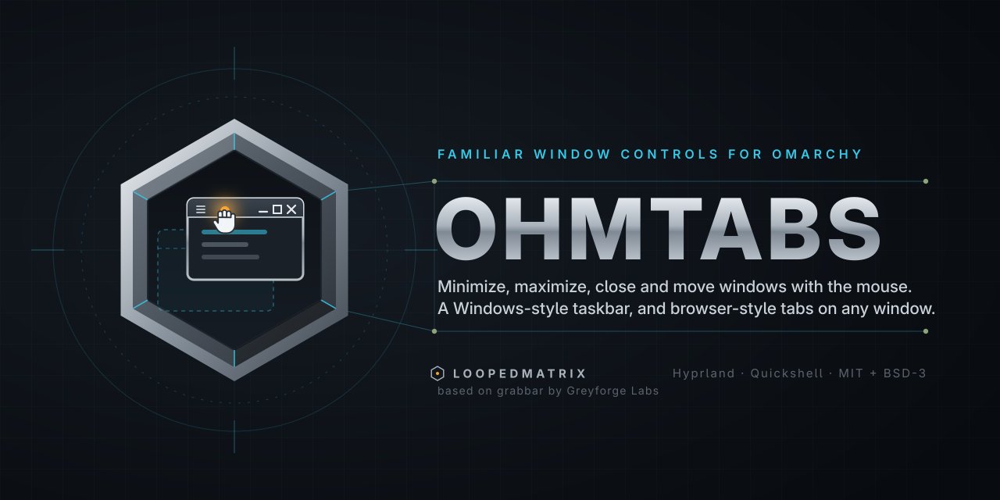
</p>

<p align="center">
  <a href="https://github.com/LoopedMatrix/ohmtabs/actions/workflows/test.yml"></a>
  <a href="LICENSE"></a>
  
  
</p>

**OhmTabs** is a [Quickshell](https://github.com/outfoxxed/quickshell) + Hyprland plugin for [Omarchy](https://omarchy.org/). It adds the window chrome Omarchy does not ship:

- a **glass pill title strip** on each app (− □ ×, drag, double-click maximize; matches the dock)
- a **glassy pill taskbar** for open, minimized, and pinned apps (one icon per window)
- a **Windows-style Super Menu** (Start on the dock: apps, pins, widgets, settings)
- a **macOS-style Alt+Tab HUD**
- optional **window tabs** (drop one window onto another)

The store card is [`preview.png`](preview.png). Title strip, dock, Super Menu, and desktop crops are **live grim** of a private Brave `about:blank` window — no bookmarks, no pages, no Omarchy stats bar. Alt+Tab / hover stay as diagrams so window titles never leak.

<p align="center">
  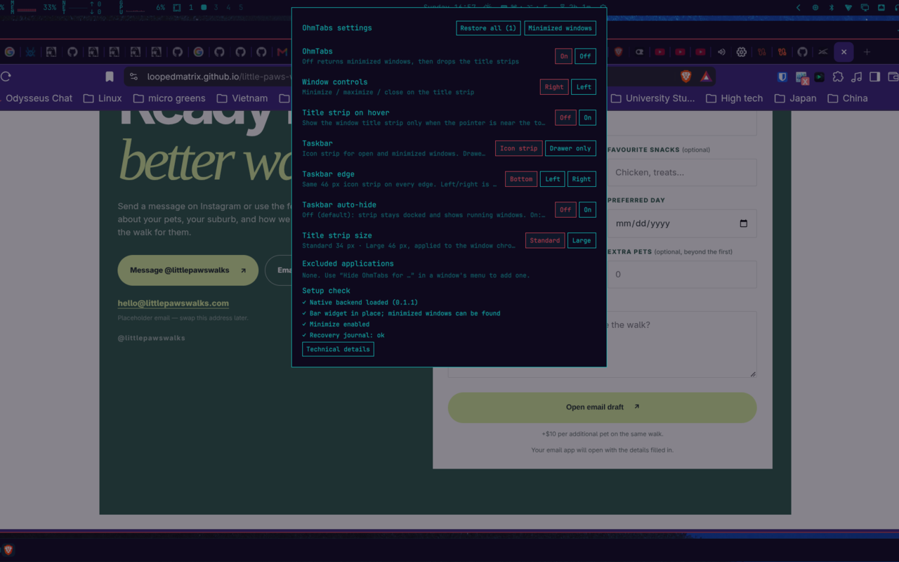
</p>

---

## Everyday use

| Action | What happens |
| --- | --- |
| **Title strip −** | Window parks on `special:ohmtabs-minimized` and stays on the dock |
| **Title strip □ / ×** | Maximize/restore · close |
| **Drag the strip** | Move the window (tiled windows detach to floating) |
| **Left-click a dock icon** | Focus a running app, restore a minimized one, or launch a pin |
| **Right-click a dock icon** | Pin / unpin, launch, restore, minimize, maximize, float, close |
| **Right-click empty dock** | Dock Settings |
| **Start (four squares)** | Super Menu — apps, pins, search, widgets. Gear opens Super Menu settings (separate from Dock Settings). |
| **Hover an icon** | Glassy name card (when *Icon name on hover* is on) |
| **Alt+Tab** | HUD over the focused monitor (bind it — see [User guide](docs/USAGE.md#alttab)) |

Workspaces, status chips, the focused-window title, and − □ × on the **Omarchy top bar** are **off** unless you turn them on in Dock Settings.

Full walkthrough: **[docs/USAGE.md](docs/USAGE.md)**.

## Screenshots

<p align="center">
  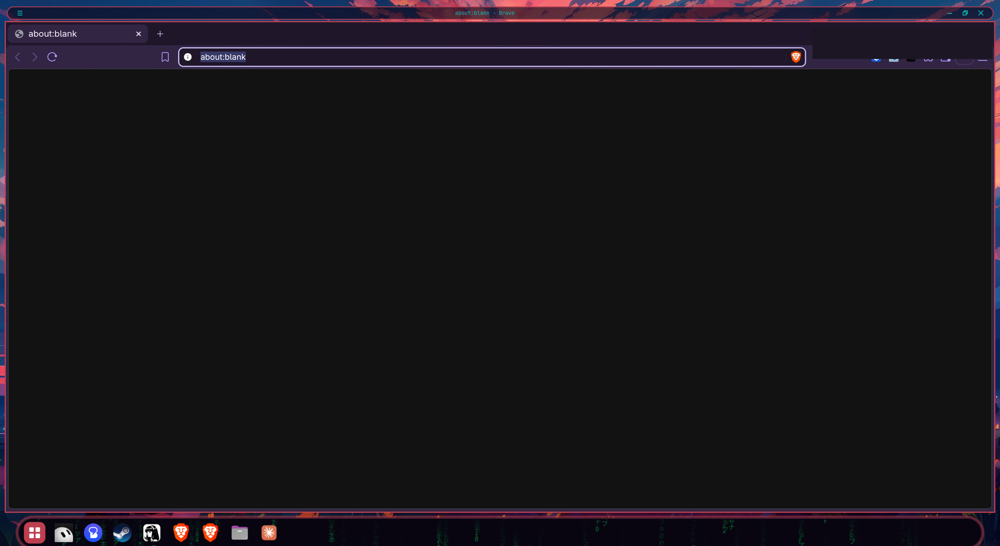
</p>
<p align="center"><sub>Live glass title strip + pill dock on a blank Brave window.</sub></p>

<p align="center">
  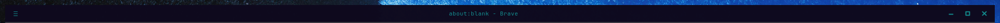
</p>
<p align="center">
  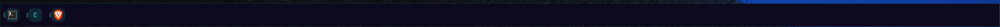
</p>
<p align="center">
  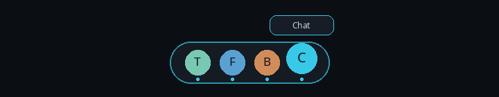
</p>
<p align="center">
  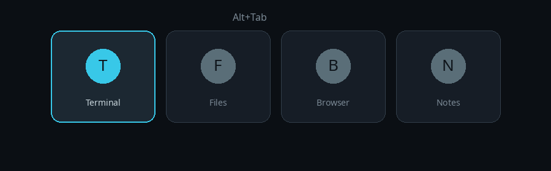
</p>
<p align="center">
  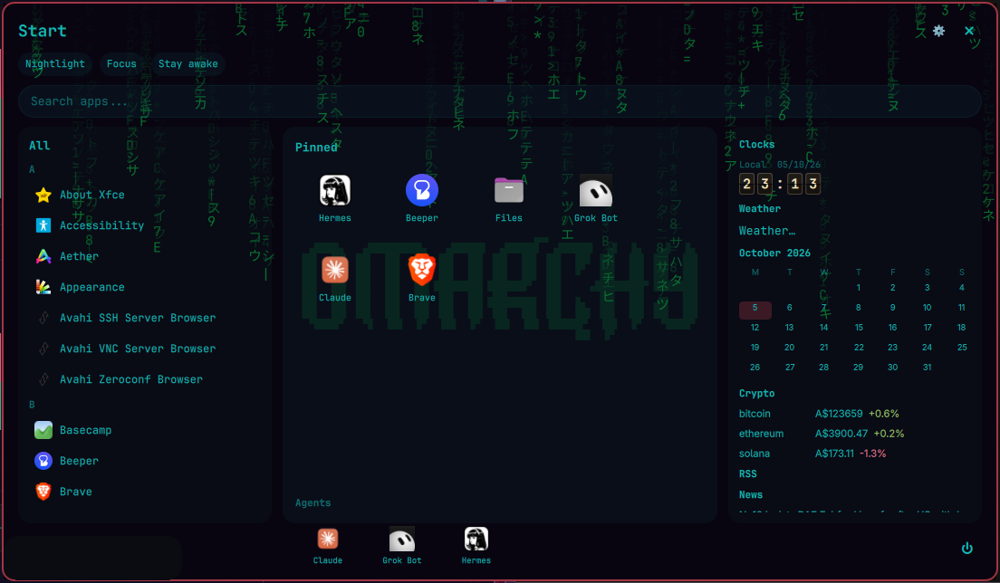
</p>
<p align="center"><sub>Super Menu over a private Brave window: app list, pins, Matrix rain, flip clock, calendar, crypto.</sub></p>
<p align="center">
  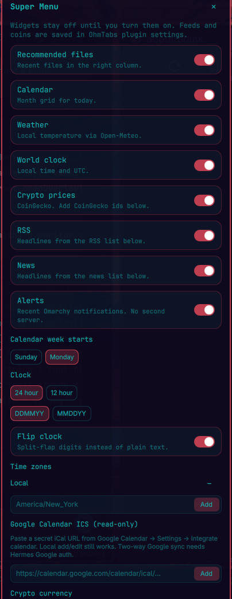
</p>
<p align="center"><sub>Super Menu settings — widgets, clocks, feeds, coins. Not mixed into Dock Settings.</sub></p>
<p align="center">
  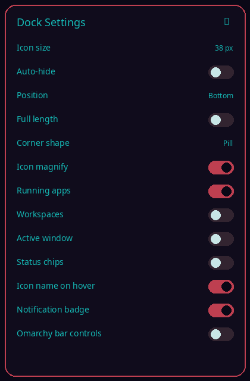
</p>
<p align="center">
  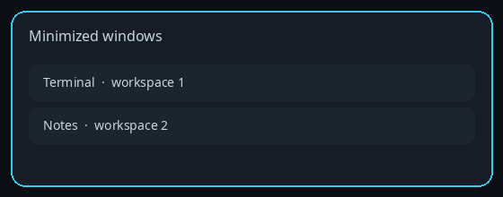
</p>

## Requirements

- Omarchy 4 (Arch + Hyprland **0.56.2** — native half uses the Lua dispatcher API)
- Quickshell (shipped with Omarchy), Qt 6, a C++17 compiler and `make`
- Optional: `bin/ohmtabs` on `PATH`

Do **not** run another minimize/taskbar/dock plugin next to OhmTabs (Grabbar, omarchy-minimize, omadock, macos.dock, animated.dock, caelestia-shell). Those fight the same workspace and the same bottom edge.

## Install

Two parts: the **shell plugin** and the **native strip backend**.

```sh
omarchy plugin add https://github.com/LoopedMatrix/ohmtabs.git --enable
cd ~/.config/omarchy/plugins/tech.loopedmatrix.ohmtabs
make -C native/ohmtabs CXX=g++
hyprctl plugin load ./native/ohmtabs/ohmtabs.so
ln -s "$(pwd)/bin/ohmtabs" ~/.local/bin/ohmtabs   # optional
ohmtabs autoload enable                           # survive compositor restarts
```

Without the `.so` there are no title strips and Minimize stays off; the dock, settings, and IPC still mount.

[`docs/AUTOLOAD.md`](docs/AUTOLOAD.md) covers the boot guard.

## Configuration

Right-click the dock → **Dock Settings**, or edit the plugin entry in `~/.config/omarchy/shell.json`. Values hot-apply.

| Key | Default | Effect |
| --- | --- | --- |
| `enabled` | `true` | Master switch. Off restores minimized windows, then drops strips. |
| `buttonsLeft` | `false` | Title-strip controls on the left. |
| `showOnHover` | `false` | Strip only while the pointer is near the top edge. |
| `controlSize` | `"standard"` | Strip height: 34 px / `"large"` 46 px. |
| `excludedClasses` | `[]` | Apps with no title strip. |
| `sidePanel` | `true` | Pill taskbar. `false` = bar drawer only. |
| `panelPosition` | `"bottom"` | `top` / `left` / `right` / `bottom`. |
| `panelAutoHide` | `false` | Park until the edge is brushed (reveal is still rough). |
| `barWindowControls` | `false` | − □ × on the Omarchy **top bar** for the focused window. |
| `iconSize` | `38` | Dock icon size, 16–48. |
| `tintIcons` | `false` | Recolor icons to theme ink. |
| `showIconName` | `false` | Hover title card. |
| `magnify` | `true` | Grow the icon under the pointer. |
| `fullLength` | `false` | Span the whole edge. Compact pill still **reserves 62 px**. |
| `cornerShape` | `"pill"` | `pill` / `rounded` / `square`. |
| `pinnedApps` | `[]` | App ids kept on the dock with no window. Reverse-DNS classes (`com.vendor.app`) merge with the short id. |
| `showAppsButton` | `true` | Start button on the dock → Super Menu. |
| `showRunning` | `true` | Open windows on the dock. |
| `dockDodge` | `false` | Park if a window covers the dock. Off keeps the reserved strip. |
| `showWorkspaces` | `false` | Workspace pips. |
| `showActiveWindow` | `false` | Focused-window title on the dock. |
| `showClock` / `showStatus` | `false` | Clock · mute/Wi-Fi/Bluetooth chips. |
| `showNotifs` / `showDashboard` / `showOsd` | `false` | Bell drawer · window overview · volume/brightness pill. |
| `tabGroups` | `false` | Drop-to-tab, group Alt+Tab, close-all confirm. |

Unknown keys are ignored. Validation: [`OhmTabsModel.js`](OhmTabsModel.js).

## Command line

```
ohmtabs                      open the drawer (Settings when OhmTabs is off)
ohmtabs setup|settings       Dock Settings
ohmtabs status [--json]
ohmtabs restore TOKEN [--original]
ohmtabs restore-all
ohmtabs doctor               read-only diagnostics
ohmtabs autoload status|enable|disable|retry
ohmtabs enable|disable
ohmtabs alttab next|prev     window-switcher HUD
```

IPC: `omarchy-shell tech.loopedmatrix.ohmtabs <method>` — `status`, `minimize`, `restore`, `restoreAll`, `openDrawer`, `openSettings`, `applySettings`, `altTabNext` / `altTabPrev` / `altTabCancel`, `openNotifs`, `openDashboard`, tab-group verbs. Tokens look like `g1789644541-6`. Details: [docs/PROTOCOL.md](docs/PROTOCOL.md).

## Development

```sh
make -C native/ohmtabs CXX=g++
/usr/lib/qt6/bin/qmllint --bare BarWidget.qml   # import-path warnings are expected
tests/run.sh
omarchy plugin validate .
```

Work in git worktrees. Never write into a mapped `.so` — replace it with `mv`. Nested Hyprland: [docs/QUALIFICATION.md](docs/QUALIFICATION.md).

## Troubleshooting

**No strips, Minimize refused.** Native half not loaded: `hyprctl plugin list` should show `OhmTabs`. Then `ohmtabs autoload status` / `retry`.

**Two copies of the same app on the dock.** Pins and running windows share a dock id (`com.nousresearch.app` ≡ `app`). If you still see a title chip next to an icon, turn **Active window** off.

**Shell frozen on `Cannot assign to read-only property "settings"`.** Widgets must declare `settings` writable. Fixed in `0d79811`.

**Do not install a second dock.** One plugin owns `special:ohmtabs-minimized` and the bottom exclusive zone.

## Known issues

1. Native `m_showOnHover` is both the mode flag and the revealed-state flag (upstream).
2. Taskbar auto-hide reveal is unreliable — leave it **off**.
3. Tab-strip selected/unselected contrast is flat. Work in progress.

## Documentation

- [User guide](docs/USAGE.md)
- [Architecture](docs/ARCHITECTURE.md) · [Protocol](docs/PROTOCOL.md) · [Compatibility](docs/COMPATIBILITY.md)
- [Distribution](docs/DISTRIBUTION.md) · [Autoload](docs/AUTOLOAD.md) · [Upstream](docs/UPSTREAM.md)
- [Qualification](docs/QUALIFICATION.md) · [Release safety](docs/RELEASE-SAFETY.md)
- [CHANGELOG](CHANGELOG.md) · [CONTRIBUTING](CONTRIBUTING.md) · [SECURITY](SECURITY.md)

## License & credits

MIT — see [LICENSE](LICENSE). The native title-strip backend derives from **hyprbars** (BSD-3-Clause, [THIRD_PARTY_NOTICES](THIRD_PARTY_NOTICES)). OhmTabs is a fork of **grabbar by [Greyforge Labs](https://github.com/GreyforgeLabs/omarchy-grabbar)**; upstream notices stay intact. Taskbar icon tinting (`TintedIcon.qml`) is adapted from [Davedes83/animated-dock](https://github.com/Davedes83/animated-dock) (MIT). Pin/launch follows [thepathless/omadock](https://github.com/thepathless/omadock) (MIT). Dock *behaviors* similar to Caelestia are reimplemented independently — no code from [caelestia-dots/shell](https://github.com/caelestia-dots/shell) (GPL-3.0). Maintained by [LoopedMatrix](https://github.com/LoopedMatrix).
