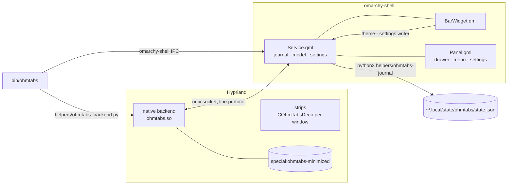

# Architecture

OhmTabs is two cooperating parts inside processes that already exist on an
Omarchy desktop, plus short-lived helpers. No daemon, no second Quickshell,
no network.

## Native backend (`native/ohmtabs/`)

Derived from Hyprbars (see `UPSTREAM.md`). Three responsibilities:

1. **Strips.** `COhmTabsDeco` is an `IHyprWindowDecoration` with a reserved
   top band (`DECORATION_POSITION_STICKY`, `reserved = true`). It draws the
   bar colour, the ellipsized title and the control glyphs — cairo paths,
   cached per glyph/size/colour — and handles press/release/drag. Input
   goes through the same hit validation as Hyprbars: layer surfaces above
   the window and seat grabs win.
2. **Identity and actions.** `COhmTabsBackend` keeps `token → tracked
   window`. Actions (`minimizeCommit`, `restore`, `setMaximized`,
   `closeWindow`, `setFloating`) resolve the token, re-check the live
   window, and call typed compositor actions (`Config::Actions::*`) with an
   explicit `PHLWINDOW`. No dispatcher strings, no shell commands.
3. **Ownership and recovery.** Minimized windows live on
   `special:ohmtabs-minimized`, which OhmTabs creates and owns. The
   backend records the origin (workspace, monitor, tiled/floating,
   pinned, maximized, floating geometry) before moving. If the shell goes
   away for longer than the grace period, or the plugin is unloaded, the
   backend returns every owned window from its in-memory snapshots.

The backend starts **suspended** (no strip, no reserved space) and becomes
active only after a shell completes the readiness handshake. It writes one
file: the boot-guard marker `<state>/ohmtabs/autoload/last-ok` after 15 s
of uptime (see `AUTOLOAD.md`).

## Shell service (`Service.qml`, `OhmTabsModel.js`)

`Service.qml` is the backend's single shell client and the only writer of
the journal. `OhmTabsModel.js` holds every state transition as a pure
function (Node tests run it directly):

- **Minimize** is two-phase. `minimizeRequest` → `prepareEntry` →
  journal written (`helpers/ohmtabs-journal write`: temp file, fsync,
  rename, `0600`) → `minimizeCommit` → `commitEntry` on `result ok`, or
  `cancelEntry` on refusal. A failed journal write cancels before anything
  moves.
- **Restore** marks the row `restoring`, sends the action, and removes the
  row only when the backend reports the window visible (`hidden=0`); a
  failure leaves the row as `failed` with Retry.
- **Reconciliation** (`reconcile()`) runs after every snapshot: journal
  entries versus live windows, per spec §7.4. A journal from another
  compositor session or a corrupt one is quarantined
  (`state.<ts>.<reason>.quarantined.json`, five kept) and the live owned
  workspace is the source of truth.
- **Settings** come from this plugin's entry in `~/.config/omarchy/shell.json`
  (watched) with a mirror under the state dir; the bar widget lends the
  host's `updateEntryInline` writer. Settings and the Omarchy palette are
  pushed to the backend on every (re)connect.

## Shell UI

- `BarWidget.qml` — the restore entry point. Its presence is what lets
  the service declare `restoreAccess=1`. It also pushes the theme colours
  and registers the settings writer.
- `Panel.qml` — one overlay with three views (`open(payloadJson)`
  selects): the drawer, the window menu (positioned at the pointer on the
  right screen), and settings. Keyboard: arrows/j/k, Enter (Shift+Enter =
  original workspace), Ctrl+A restore all, Escape.

## Helpers and CLI

- `helpers/ohmtabs-journal` — atomic journal I/O, refuses symlinks and
  foreign-owned paths, quarantines damage.
- `helpers/ohmtabs_backend.py` — socket client used by the CLI, the tests
  and as a stand-in shell in the G0 rig.
- `helpers/ohmtabs-autoload` — the login hook and boot guard state.
- `bin/ohmtabs` — user-facing CLI (see README).

## Lifecycle summary

| Event | What happens |
| --- | --- |
| Native plugin loads | Socket created, strips attached but suspended, boot-guard timer armed |
| Shell connects + `ready` | Snapshot, reconcile against journal, strips active, theme/settings pushed |
| Shell disconnects | Minimize refused at once; after `shell_grace_ms` owned windows return and strips suspend |
| Shell reconnects in time | New snapshot, reconcile, resume |
| Settings → Off | `pause`: windows return, strips off, Minimize refused; `resume` on On |
| Another tool focuses a hidden window / opens OhmTabs's workspace | Deferred one turn: the focused hidden window is restored to the monitor's workspace and focused; the special workspace view is closed |
| `hyprctl plugin unload` | Owned windows return before native references drop; shell shows "backend not loaded" |
| Compositor restart | Nothing survives (as with any compositor); the journal from the old session is quarantined, not replayed |
